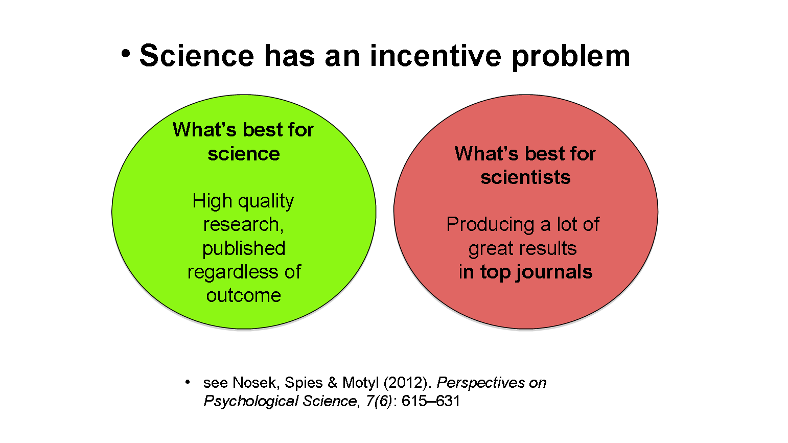
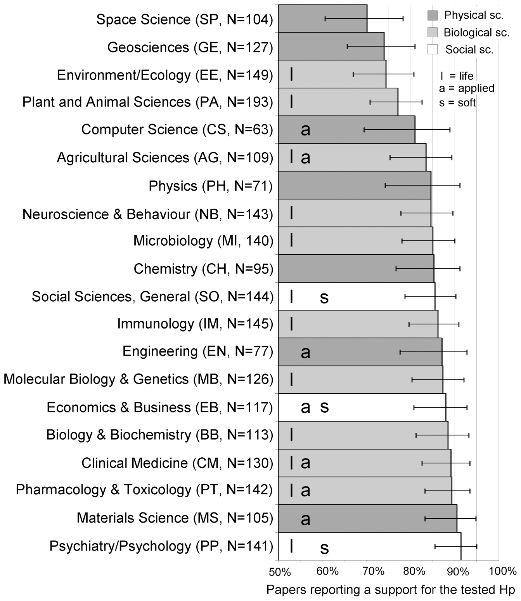
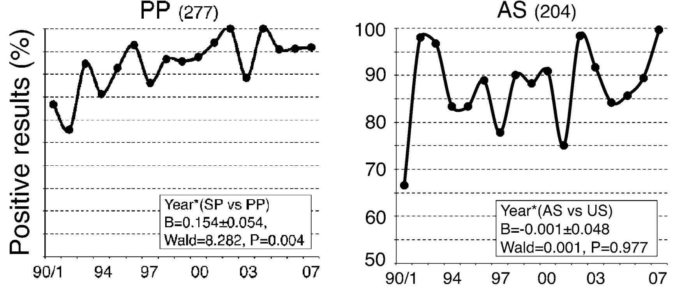
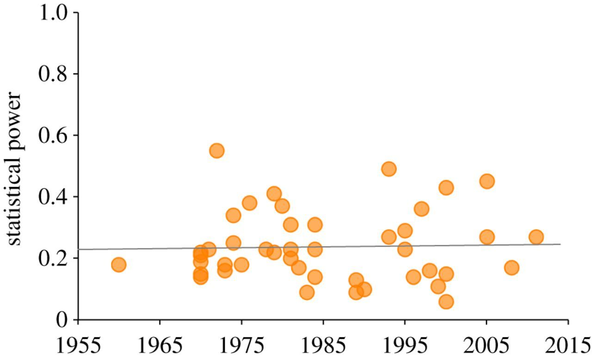
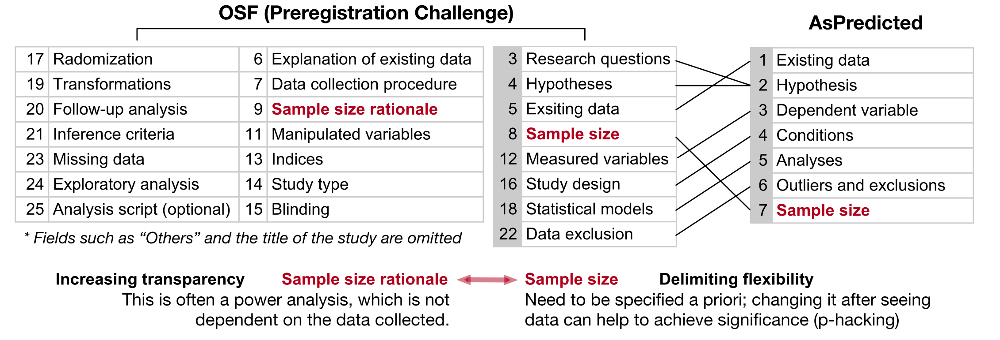
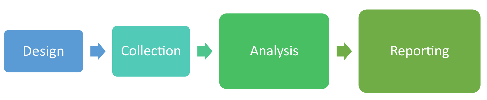
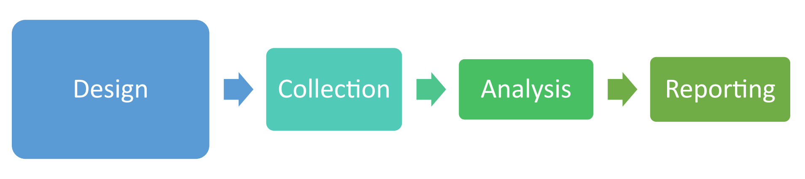

# About this workshop   关于工作坊 {data-background=#f2f6f5}

## {data-background=#f2f6f5}

>- Broadcasting channel 网路直播网址: [详见微信公告](https://mp.weixin.qq.com/s/FeBZZJAMQsGbQoezpZDy1g)
>- Code of Conduct 活动守则

## {data-background=#f2f6f5}

- 旁听观众可在ZOOM聊天区提问讨论。发言请保持网路礼仪，请勿恶意灌水。
- 协助人员请尽量在参与者明确请求口头咨询，再开啓麦克风交谈。作业时间尽量在OSF留言交流。
- 参与者可和协助人员交换微信帐号，做为作业时间备用交流平台。旁听观众请勿透过微信私讯或微信群打扰参与者作业。
- 参与者在作业时间可视个人状态稍做休息，只要预定时间结束前完成设定的目标。
- 一位参与者闪电报告限时五分鈡，时间到立即静音。

# About me   关于我  {data-background=#f2f6f5}

##  {data-background=#f2f6f5}

Sau-Chin Chen  
<small>Associate professor, Department of Human Development and Psychology</small>  
<small>Tzu-Chi University</small>

 <small>Center for Open Science, Ambassador</small> 

<small>Psychological Science Accelerator, Fellow, Assistant Director</small> 
 [<small>scchen.com</small>](http://scchen.com)

<small>[Fork my slides on Github](https://github.com/SCgeeker/Prereg_workshop)</small>

## Primary Source   主要资讯来源 {data-background=#f2f6f5}

>- COS: Jolene Esposito, Sara Bowman
>- Cardiff University: [Chris Chambers](https://osf.io/d4fh5/)

# Why Preregister   为何需要预注册 {data-background=#f2f6f5}

## {data-background=#f2f6f5}

- Which part of a research study do you believe is most important for advancing your career? 身为学术工作者，您认为与您的生涯发展最有关系的论文内容是什么？
  - The results 结果
- Which part of a research study do you believe should be beyond your control as a scientist? 身为科研人员，您认为研究论文的那个部分最不受控制？
  - The results 结果

 Source: [Chris Chambers](https://osf.io/d4fh5/), Cardiff U.

## {data-background=#f2f6f5}

## Prevailence of researchers' flexibility   弹性研究操作的盛行 {data-background=#f2f6f5}

<table class="tg">
  <tr>
    <th class="tg-hgcj">Hypothesis</th>
    <th class="tg-hgcj">Design</th>
    <th class="tg-hgcj">Collection</th>
    <th class="tg-amwm">Analysis</th>
    <th class="tg-amwm">Reporting</th>
  </tr>
  <tr>
    <td class="tg-0lax"> Vague hypotheses Effect sizes of interest </td>
    <td class="tg-0lax"> Multiple IVs Multiple DVs Measuring many vars  Multiple exclusion vars  (i.e., manipulation checks) Sample size planning  (power analysis) </td>
    <td class="tg-0lax"> Blinding Random assignment Dropping participants Optional stopping </td>
    <td class="tg-0lax"> Missing data handling Data pre-processing Dealing with stat.   assumption violation Outlier handling Selecting DVs Selecting IVs Selecting covariates Selecting statistical models Selecting inference criteria </td>
    <td class="tg-0lax"> Selective outcome reporting Selective reporting of studies HARKing </td>
  </tr>
  </table>

 Source: [Cassandra Brandes](https://osf.io/h867e/), Northwestern U.

## “Positive” Results Increase Down the Hierarchy of the Sciences {data-background=#f2f6f5}

{ width=45% }

 Source:   [Fanelli(2010)](http://journals.plos.org/plosone/article?id=10.1371/journal.pone.0010068) 

## Negative results are disappearing from most disciplines and countries

 Source:  [Fanelli(2012)](https://doi.org/10.1007/s11192-011-0494-7) 

## Sixty years of low-powered studies   回顾一甲子社会与行为研究的检定力  {data-background=#f2f6f5}

{ width=70% }

 Source:  [Smaldino and McElreath (2016)](https://doi.org/10.1098/rsos.160384) 

## Two Explanations 两种可能的解释  {data-background=#f2f6f5}

1. 心理学只能探讨有巨大效应量支持的假设
2. 负面结果很难发表
- 抽屉效应
- p-hacking
- 各种不良研究操作
- 犞枉过正的评审过程

 Source:  [Schijen, Scheel, and Lakens (2019)](https://osf.io/64d8u/) 

# What is preregistration   什么是预注册  {data-background=#f2f6f5}

## {data-background=#f2f6f5}

- A time-stamped document describing the details of the planned
study. 含日期戳记，描述研究计划细节的文件。(Julia Rohrer osf.io/e4fja)

- A document that states the plans for a study prior to 
its completion. 研究完成前宣告计划细节的文件。(Cassandra Brandes osf.io/h867e/)

## A research proposal is   研究计划必定是 {data-background=#f2f6f5}

>- Public 公开
>- Static 稳定
>- Time-stamped 可追溯

## Preregistration/Registered Report   預註冊與註冊報告

 Source:  [Pu, Zhu, Kay, and Conrad (2019)](https://osf.io/w5ked)   
 
[Tracking Registered Report Journals](https://docs.google.com/spreadsheets/d/1D4_k-8C_UENTRtbPzXfhjEyu3BfLxdOsn9j-otrO870/notify/show?rev=2705&fromRev=2693&s=AM5m-fiZkYInmHS2H_PGqACz34fIdgJ2sQ&usp=gmail)注册报告期刊讯息更新

# How preregister   如何预注册 {data-background=#f2f6f5}

## Identify your purpose   确认计画目的 {data-background=#f2f6f5}

>- Delimilating flexibility 划出弹性操作的界限
>- Increasing transparency 增加研究透明度
>- Designing and implementing experiments 设计研究操作指南
>- Educating preregistration and research 学习与教授研究方法

 Source:  [Pu, Zhu, Kay, and Conrad (2019)](https://osf.io/w5ked) 

## Compare preregistration formats   两种常见预注册格式

 Source:  [Pu, Zhu, Kay, and Conrad (2019)](https://osf.io/w5ked) 

# Introdution   参与者自介 {data-background=#f2f6f5}

# Recommended Steps   建议步骤 {data-background=#f2f6f5}

## State your priori hypothesis and confrimative analysis   事前充分描述如何确证假设 {data-background=#f2f6f5}

|[Chen et al.(2018, preprint)](https://psyarxiv.com/a3vwc/)|[Chen et al.(2019, preprint)](https://psyarxiv.com/t2pjv/)|
|---|---|
|大型物体的方向效应高于 小型物件的方向效应|任何英语系国家实验室 都能重现物件方向效应|
|物体方向效应与心像旋转无关|语法特性与心像旋转无关|
|方向效应效应量 d = 0.1|方向效应效应量 d = 0.1|

## State your data-driven decisions   事前充分描述如何探索资料 {data-background=#f2f6f5}

|[Chen et al.(2018, preprint)](https://psyarxiv.com/a3vwc/)|[Chen et al.(2019, preprint)](https://psyarxiv.com/t2pjv/)|
|---|---|
|运用荟萃分析及混合线性模型 分析语言之间差异|运用混合线性模型 分析动词变化与方向效应的关联性|

## Declare what you have to/have not to do   宣告必须做/不能做的研究操作 {data-background=#f2f6f5}

<table class="tg">
  <tr>
    <th class="tg-88nc">Design</th>
    <th class="tg-88nc">Collection</th>
    <th class="tg-7btt">Analysis</th>
    <th class="tg-mqa1">Reporting</th>
  </tr>
  <tr>
    <td class="tg-0pky">Define IVs Define DVs Define mediators  Rules for excluding variables Reasonable sample size plan</td>
    <td class="tg-0pky">Reproducible randomization Criterion for dropping participants Using sequential analysis </td>
    <td class="tg-0pky">Plan to handle missing data Plan to handle outlier Generate the codebook since pilot Backups for stat. assumption violation Setup the model for selecting variables Preregister the analytic code if possible </td>
    <td class="tg-73oq">Use preregistered plan  being your writing guide Distinguish confirmation and exploration </td>
  </tr>
</table>

# Code of Hackthon   黑客原则 {data-background=#f2f6f5}

## Pareto principle   80/20法则 {data-background=#f2f6f5}

>- Core of your project (20%) is up to 80% thinking stream for this project 
>- 专案计划最核心的20%占据你为此付出的80%思考时间

## Old School workshop   常见的学术工作坊设计 {data-background=#f2f6f5} 

 Source: [Cassandra Brandes](https://osf.io/h867e/), Northwestern U.

## Open School workshop   开放科学工作坊设计 {data-background=#f2f6f5} 

 Source: [Cassandra Brandes](https://osf.io/h867e/), Northwestern U.

## Schedule   今日进程  {data-background=#f2f6f5} 

|Working 1 hours | 作业约1小时：设定假设与探索方向 |
|:---:|:---:|
| Lunch 1.5 hours | 午饭休息 |
| Mid-Term Lightning Talk: 15 minutes| 上午作业闪电报告 |
| Working 1 ~ 2 hour | 作业约2小时：设定分析方法及判断标准 |
| Final Report: 30 minutes | 结案报告 |
| Ending | 结束讨论交流 |

# Working Part 1   作业时间1 {data-background=#f2f6f5}

# Mid-Term Debrief   参与者中途报告 {data-background=#f2f6f5}

# Working Part 2   作业时间2   {data-background=#f2f6f5}

# Final Report   参与者成果报告 {data-background=#f2f6f5}

# End: Just first step   结尾：只是第一步 {data-background=#f2f6f5}

## 7 Steps to Open   七步开放操作  {data-background=#f2f6f5}

- [Flyer](https://osf.io/hktmf/) by NOSI
- [scienceverse package](https://scienceverse.github.io/scienceverse/)